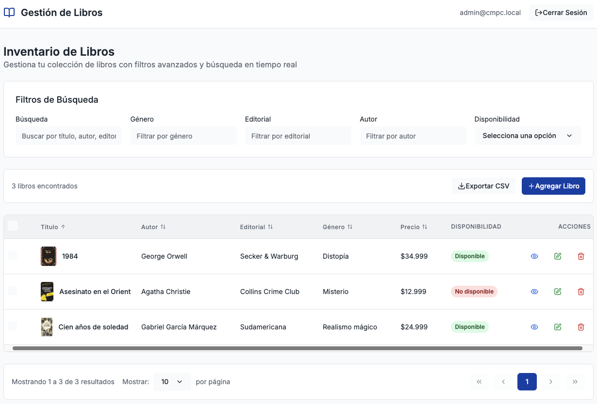

# CMPC-libros – Sistema de Gestión de Libros Fullstack


_Captura principal de la aplicación mostrando la interfaz de gestión de libros_

## 🚀 Puesta en marcha rápida

1. **Configurar variables de entorno** (automático con valores por defecto):

   ```bash
   # El archivo .env del backend se crea automáticamente con valores seguros
   # No requiere configuración manual
   ```

2. **Levantar todo el stack con un solo comando**:

   ```bash
   docker compose up --build
   ```

3. **Acceder a los servicios**:

   - 🌐 **Frontend**: http://localhost:8080
   - 📚 **Backend/API**: http://localhost:3000/api
   - 📖 **Swagger Docs**: http://localhost:3000/api/docs
   - ❤️ **Health Check**: http://localhost:3000/api/health

4. **Credenciales de prueba**:

   - **Email**: `admin@cmpc.local`
   - **Password**: `admin1234`

5. **Para apagar**:

   ```bash
   docker compose down
   ```

6. **Para limpiar volúmenes** (destructivo - elimina imágenes y datos):
   ```bash
   docker compose down -v
   ```

## ✨ Características implementadas

### 🔐 **Autenticación y Seguridad**

- ✅ JWT con protección de rutas
- ✅ Middleware de autenticación
- ✅ CORS configurado
- ✅ Validación de datos con pipes

### 📚 **Gestión de Libros**

- ✅ CRUD completo (Create, Read, Update, Delete)
- ✅ Soft-delete con auditoría
- ✅ Filtros avanzados (título, autor, editorial, género, disponibilidad)
- ✅ Búsqueda con debounce (300ms)
- ✅ Paginación server-side
- ✅ Ordenamiento multi-campo
- ✅ Exportación CSV manteniendo filtros
- ✅ **Subida de imágenes con Multer** (almacenamiento local persistente)
- ✅ **Visualización de imágenes** en tabla, detalles y formularios

### 🎨 **Frontend Moderno**

- ✅ React 18 + TypeScript + Vite
- ✅ UI responsive y moderna
- ✅ Tipado estricto
- ✅ Contexto de autenticación
- ✅ Manejo de estados con hooks
- ✅ Formularios con validación

### 🏗️ **Backend Robusto**

- ✅ NestJS + TypeScript
- ✅ PostgreSQL + Sequelize ORM
- ✅ Interceptors de logging y transformación
- ✅ Filtros globales de excepciones
- ✅ Swagger/OpenAPI documentación
- ✅ Health checks

### 🧪 **Testing y Calidad**

- ✅ **Cobertura de tests: 91.61%** (objetivo ≥80%)
- ✅ Tests unitarios con Jest
- ✅ Tests de integración
- ✅ Linting y formateo automático

### 🐳 **DevOps y Deployment**

- ✅ Docker Compose orquestación
- ✅ Multi-stage builds optimizados
- ✅ Health checks en todos los servicios
- ✅ Variables de entorno configuradas
- ✅ Nginx para servir frontend
- ✅ Single command deployment
- ✅ **Volúmenes persistentes** para imágenes y base de datos

## 🛠️ **Stack Tecnológico**

**Frontend**: React 18 + TypeScript + Vite + CSS Modules  
**Backend**: NestJS + TypeScript + PostgreSQL + Sequelize  
**Auth**: JWT + bcrypt  
**Docs**: Swagger/OpenAPI  
**DevOps**: Docker + Docker Compose + Nginx  
**Testing**: Jest + Supertest

---

## Objetivo

Digitalizar procesos de inventario para una tienda de libros (CMPC-libros), con:

- CRUD de libros (título, autor, editorial, precio, disponibilidad, género, imagen)
- Autenticación JWT
- Filtros avanzados, orden multi-campo, paginación server-side, búsqueda con debounce
- Exportación CSV
- Soft-delete, logging/auditoría
- Tests (≥ 80% cobertura)
- Despliegue local con Docker

---

## Estructura

```text
.
├─ cmpc-libros-frontend/   # React + Vite (Nginx)
├─ cmpc-libros-backend/    # NestJS + Sequelize
└─ docker-compose.yml      # Orquestación local
```

---

## Requisitos

- Docker 20+ y Docker Compose 2+
- Puertos libres: `3000` (API), `8080` (Web), `5432` (DB)

---

## Variables de entorno

### Backend (`cmpc-libros-backend/.env`)

```env
PORT=3000
NODE_ENV=development

# JWT
JWT_SECRET=supersecretchangeme-pon-uno-largo
JWT_EXPIRES_IN=1d

# DB
DB_HOST=postgres
DB_PORT=5432
DB_NAME=cmpc_libros
DB_USER=cmpc
DB_PASS=cmpc_password

# Logging
LOG_LEVEL=debug

# CORS (coma-separado si hay múltiples orígenes)
CORS_ORIGINS=http://localhost:8080
```

### Frontend (ARG en build)

- `VITE_API_BASE_URL` (por defecto `http://localhost:3000/api`)

---

## Puesta en marcha (Docker)

1. Crear `.env` del backend (puedes copiar desde `.env.example` y ajustar valores):

   ```bash
   cp cmpc-libros-backend/.env.example cmpc-libros-backend/.env
   ```

2. Levantar todo el stack:
   ```bash
   docker compose up --build
   ```

### Servicios

- **DB**: `postgres:16-alpine`
- **migration**: corre `pgcrypto`, migrations y seeds una sola vez
- **backend**: NestJS en `http://localhost:3000/api` (Swagger: `/api/docs`)
- **frontend**: SPA en `http://localhost:8080`

Para apagar:

```bash
docker compose down
```

Para limpiar volúmenes (destructivo):

```bash
docker compose down -v
```

---

## API (Swagger)

- Documentación Swagger: `http://localhost:3000/api/docs`
- Autorización: **Bearer Token (JWT)**

### Endpoints destacados (resumen)

- `POST /api/auth/login` – login JWT
- `GET /api/auth/me` – perfil usuario autenticado
- `GET /api/books` – listado con filtros/orden/paginación (query params)
- `GET /api/books/:id` – detalle de libro específico
- `POST /api/books` – alta
- `PATCH /api/books/:id` – edición
- `DELETE /api/books/:id` – soft delete
- `POST /api/upload/book-image` – subida de imagen (multipart/form-data)
- `GET /api/books/export` – CSV con filtros
- `GET /api/health` – health check

---

## Modelo de datos (relacional)

- **users**(id UUID, email, passwordHash, role)
- **books**(id UUID, title, author, publisher, price, available, genre, imageUrl, deletedAt)
- **audit_logs**(id UUID, userId, action, entity, entityId, payload, createdAt)

**Índices sugeridos**

- `books(title)`, `books(author)`, `books(publisher)`, `books(genre)`, compuestos por filtros frecuentes.

> `gen_random_uuid()` requiere la extensión **pgcrypto** (migration incluida).

---

## Decisiones de diseño

- **NestJS modular** (principios SOLID): módulos `auth`, `users`, `books`, `audit`.
- **Sequelize + transactions** para operaciones críticas.
- **Interceptors**: logging y transformación estándar `{ success, data }`.
- **Filtros**: manejo centralizado de errores.
- **Soft delete**: `deletedAt` / `paranoid` en modelos.

---

## Frontend (React + Vite)

- Ruteo protegido, contexto de auth.
- Búsqueda con debounce, filtros y orden en servidor.
- Subida de imagen por URL (`imageUrl`) – extensible a S3 o storage local.
- Tabla paginada; formulario con validaciones reactivas.

---

## Tests

- **Backend**: unit tests (servicios/controladores/estrategias JWT) con Jest.  
  Meta ≥ 80% cobertura (algunos archivos originales estaban truncados y deben completarse).

---

## Despliegue productivo

- Usar **variables seguras** (secrets) y `NODE_ENV=production`.
- **Pinned images** / build reproducible.
- Ajustar `CORS_ORIGINS` y `VITE_API_BASE_URL`.
- Ejecutar **migraciones** en job CI/CD previo a `backend`.
- **Logs** a STDOUT (integrable con ELK/CloudWatch).

---

## 🎯 **Funcionalidades Completadas**

### ✅ **Sistema de Imágenes**

- **Subida**: Endpoint `/api/upload/book-image` con Multer
- **Almacenamiento**: Local con volumen Docker persistente
- **Validación**: Tipos (JPEG, PNG, WebP), tamaño máximo 5MB
- **Visualización**: Miniaturas en tabla, imagen completa en detalles y edición
- **URLs**: Servidas estáticamente desde `/uploads/books/`

### ✅ **Filtros Avanzados**

- **Búsqueda**: Texto libre en título, autor, editorial
- **Filtros específicos**: Género, editorial, autor, disponibilidad
- **Funcionalidad**: Todos los filtros funcionan correctamente
- **UI**: Select de disponibilidad con opciones "Todos", "Disponible", "No disponible"

### ✅ **Persistencia de Datos**

- **Base de datos**: Volumen `pgdata` para PostgreSQL
- **Imágenes**: Volumen `uploads` para archivos subidos
- **Beneficio**: Los datos persisten entre reinicios de contenedores

---

## Cómo probar ahora mismo

1. Crea `cmpc-libros-backend/.env` (ver sección de variables).
2. Ejecuta:

```bash
docker compose up --build
```

- Frontend: http://localhost:8080
- Backend/API: http://localhost:3000/api
- Swagger Docs: http://localhost:3000/api/docs
- Health: http://localhost:3000/api/health

**Usuario seed (si seeder activo):** `admin@cmpc.local` / `admin1234`
